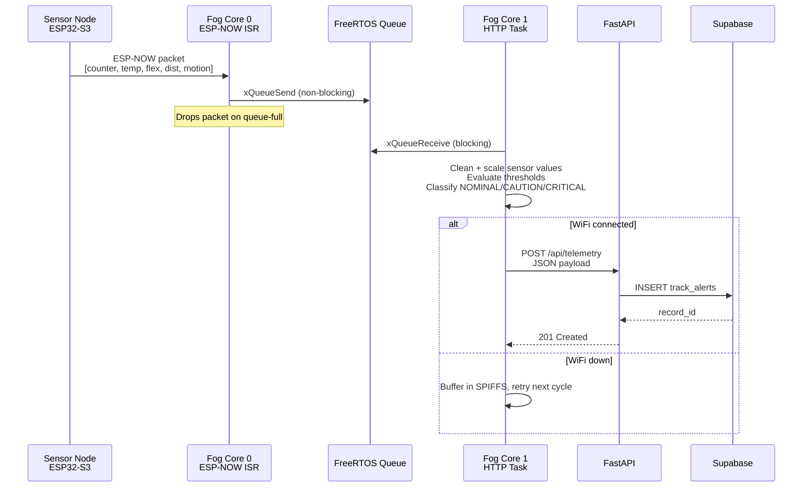
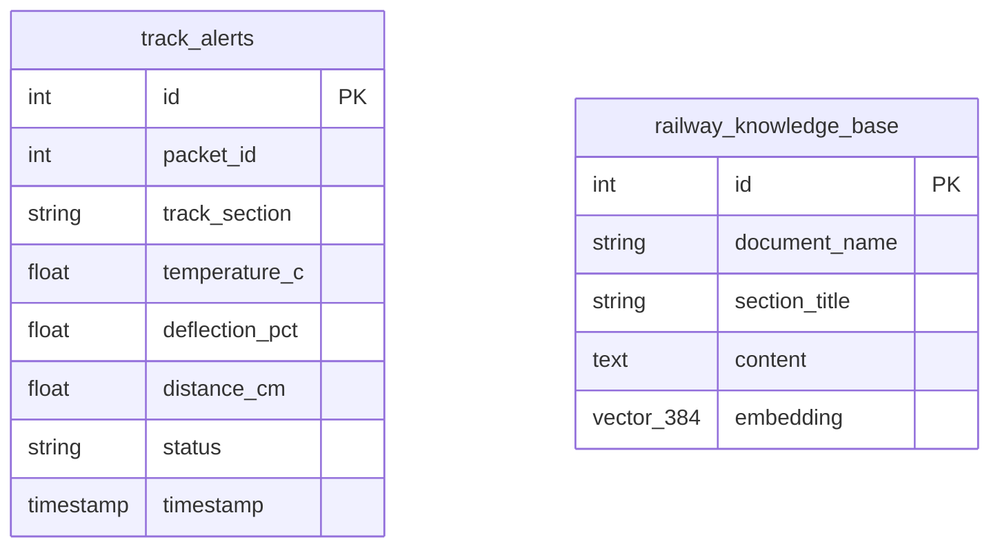

# Architecture

## System Topology

```mermaid
graph TD
    SN[Sensor Nodes<br/>ESP32-S3 + LM35 + Flex + HC-SR04] -->|ESP-NOW<br/>Channel 11, no encryption| FG

    subgraph Fog Gateway — ESP32-S3
        C0[Core 0<br/>ESP-NOW ISR + xQueueSend]
        C1[Core 1<br/>xQueueReceive + threshold eval + HTTP POST]
        Q[(FreeRTOS Queue<br/>depth=10)]
        C0 --> Q --> C1
    end

    FG --> C0

    C1 -->|POST /api/telemetry<br/>WiFi STA| API

    subgraph Backend — localhost:8000
        API[FastAPI + uvicorn]
        EMB[SentenceTransformers<br/>all-MiniLM-L6-v2<br/>384-dim]
        LLM[Ollama<br/>llama3.2:3b<br/>local inference]
    end

    API --> DB[(Supabase<br/>PostgreSQL + pgvector)]
    API --> EMB
    API --> LLM

    DASH[Dashboard<br/>polls GET /api/alerts] -->|POST /api/alerts/id/analyze| API
    DB -->|RPC match_railway_knowledge| API

    C1 -.->|WiFi down: buffer in SPIFFS<br/>retry next cycle| C1

    style SN fill:#0a0a0a,stroke:#22c55e
    style C0 fill:#0a0a0a,stroke:#f59e0b
    style C1 fill:#0a0a0a,stroke:#f59e0b
    style API fill:#0a0a0a,stroke:#22c55e
    style LLM fill:#0a0a0a,stroke:#ef4444
```

## Telemetry Ingestion Sequence



## RAG Analysis Pipeline

```mermaid
flowchart TD
    A[POST /api/alerts/id/analyze] --> B{Alert exists?}
    B -->|No| X[404]
    B -->|Yes| C[Build NL query from telemetry values]
    C --> D[Encode query<br/>SentenceTransformers 384-dim]
    D --> E[RPC match_railway_knowledge<br/>cosine similarity, top-3]
    E --> F{Chunks found?}
    F -->|No| G[Use empty context]
    F -->|Yes| H[Format context blocks<br/>with doc name + similarity score]
    G --> I
    H --> I[Construct system + user prompt]
    I --> J[POST to Ollama /api/generate<br/>llama3.2:3b, temp=0.4, max=1024 tokens]
    J --> K{Ollama responds?}
    K -->|Timeout| T[504 Gateway Timeout]
    K -->|Error| U[502 Bad Gateway]
    K -->|OK| L[Return AnalysisResponse<br/>alert_id, query, matched_documents, llm_analysis]

    style X fill:#450a0a,stroke:#ef4444
    style T fill:#450a0a,stroke:#ef4444
    style U fill:#450a0a,stroke:#ef4444
```



## Data Contracts

### Fog Node to FastAPI — POST /api/telemetry

```json
{
  "packet_id": 1024,
  "track_section": "KM-42-DELHI",
  "temperature_c": 32.4,
  "deflection_pct": 12.5,
  "distance_cm": 31.8,
  "status": "CAUTION"
}
```

| Field | Type | Required | Valid Range |
|-------|------|----------|-------------|
| packet_id | int | yes | >= 0 |
| track_section | string | no | default: "KM-42-DELHI" |
| temperature_c | float | yes | -40.0 to 125.0 |
| deflection_pct | float | yes | 0.0 to 100.0 |
| distance_cm | float | yes | 0.0 to 400.0 |
| status | string | no | NOMINAL, CAUTION, CRITICAL |
| timestamp | string | no | ISO-8601, auto-generated if omitted |

### FastAPI Analysis Response — POST /api/alerts/{id}/analyze

```json
{
  "alert_id": 16,
  "query": "Railway track alert on section KM-42-DELHI...",
  "matched_documents": 3,
  "llm_analysis": "**Maintenance Analysis...**"
}
```

| Error | Code | Cause |
|-------|------|-------|
| Alert not found | 404 | ID missing from track_alerts |
| Services not ready | 503 | Supabase or embedder not initialized |
| LLM timeout | 504 | Ollama exceeded 120s |
| LLM error | 502 | Ollama service failure |

## Database Schema


