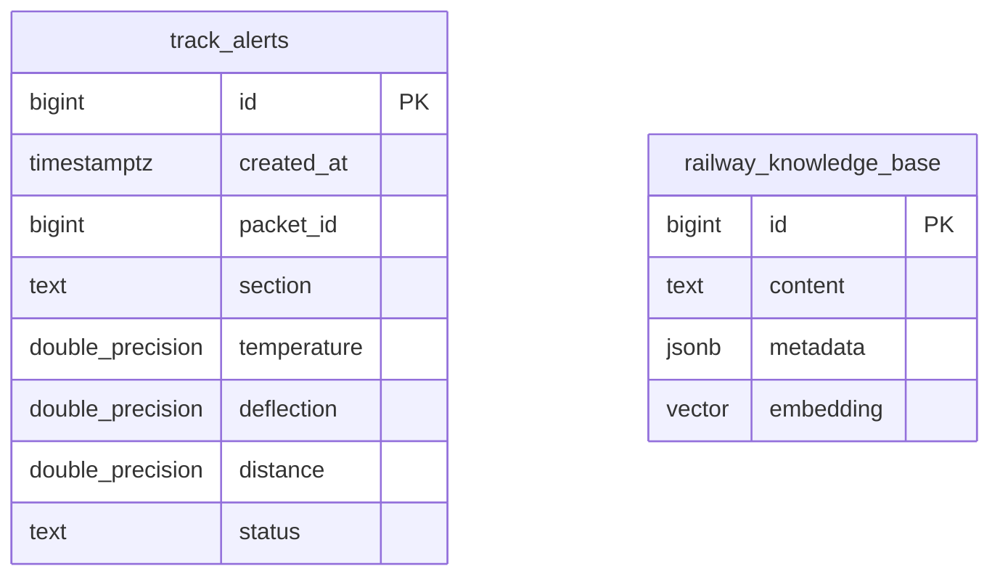

# Technical Architecture & Systems Specification

## Comprehensive System Topology

```mermaid
graph TD
    subgraph Edge Layer ["Hardware Node Network"]
        A["Flex / Deflection Strain Sensor"] -->|"Analog Voltage Rails"| C["ESP32 Sensor Node"]
        B["Ultrasonic Transceiver Unit"] -->|"Pulse Width Modulation"| C
        C -->|"ESP-NOW Broadcast Ch 11 Layer-2 Frame"| D["ESP32-S3 Fog Gateway Node"]
    end

    subgraph Fog Layer ["Gateway Core Allocation"]
        D -->|"Core 0 Atomic Intercept Loop"| E["FreeRTOS Queue Buffer"]
        E -->|"Core 1 Worker Dequeue Process"| F["Wi-Fi Station Connection Interface"]
    end

    subgraph Cloud Data Layer ["FastAPI Infrastructure"]
        F -->|"HTTP POST /api/telemetry"| G["FastAPI App Gateway"]
        G -->|"Write Relational Ingestion Row"| H[("Supabase PostgreSQL")]
        I["Web Frontend UI Console"] -->|"HTTP GET /api/alerts Live Poll"| G
        I -->|"HTTP POST /api/alerts/id/analyze Trigger"| G
    end

    subgraph Local Inference Layer ["RAG Pipeline Topology"]
        G -->|"Convert Dynamic String to Matrix Tensor"| J["all-MiniLM-L6-v2 Model"]
        J -->|"Generate 384-Dim Coordinate Array"| K["pgvector Distance Function"]
        H -->|"Execute Supabase Remote Procedure Call"| K
        K -->|"Inject Top 3 Matched Document Paragraphs"| L["Context Contextualizer Engine"]
        L -->|"Execute Token Matrix Ingestion"| M["Ollama Llama 3.2 3B Process"]
        M -->|"Pipe Chunked Line NDJSON Stream"| G
    end

    style C fill:#1a1a1a,stroke:#ef4444,stroke-width:1px
    style D fill:#1a1a1a,stroke:#f59e0b,stroke-width:1px
    style G fill:#111,stroke:#22c55e,stroke-width:2px
    style M fill:#1a1a1a,stroke:#22c55e,stroke-width:1px
```



## Hardware Network Concurrency Protocol

To resolve the physical hardware single-radio constraint on the ESP32 architecture—where switching between Wi-Fi station mode and connectionless ESP-NOW channels drops active data frames—the gateway utilizes FreeRTOS asymmetric multitasking tasks pinned explicitly to independent hardware cores:

**Core 0 (Atomic High-Priority Task):** Binds permanently to Wi-Fi Channel 11, intercepting raw incoming Layer-2 ESP-NOW frames from remote nodes within an execution cycle and pushing them directly into a thread-safe memory queue block.

**Core 1 (Background Worker Task):** Monitors the queue allocation size, switches internal radio state registers to interact safely with local network routers, and dequeues frames to push them upstream via asynchronous HTTP client routines.

## Relational Database Schema Entity Relations



## Systems Integration Data Contracts

### Ingestion Data Payload Schema (POST /api/telemetry)

```json
{
  "packet_id": 142,
  "section": "KM-42-DELHI",
  "temperature": 28.5,
  "deflection": 12.4,
  "distance": 8.2
}
```

### Verification Parameters & Operational Severity Triggers

| Metric Target | Structural Threshold Limit | Evaluated Status Output |
|---------------|---------------------------|------------------------|
| Core Rail Temperature | > 60.0°C | CAUTION |
| Vertical Strain Deflection | 5.0% to 15.0% | CAUTION |
| Vertical Strain Deflection | > 15.0% | CRITICAL |
| Lateral Clearance Boundaries | 3.0cm to 10.0cm | CAUTION |
| Lateral Clearance Boundaries | < 3.0cm | CRITICAL |

### Networked Line-Delimited JSON (NDJSON) RAG Event Stream Interface

Requests targeting `POST /api/alerts/{id}/analyze` output standard `text/event-stream` payloads split strictly across explicit structural text boundaries:

**Phase 1: Meta Initializer Event String**
```json
{"type": "meta", "alert_id": 89, "query": "Track safety alert parameters...", "matched_documents": 3}
```

**Phase 2: Generative Inference Stream Token**
```json
{"type": "token", "text": "Severity Assessment: CAUTION..."}
```

**Phase 3: Stream Terminator Sequence**
```json
{"type": "done"}
```
