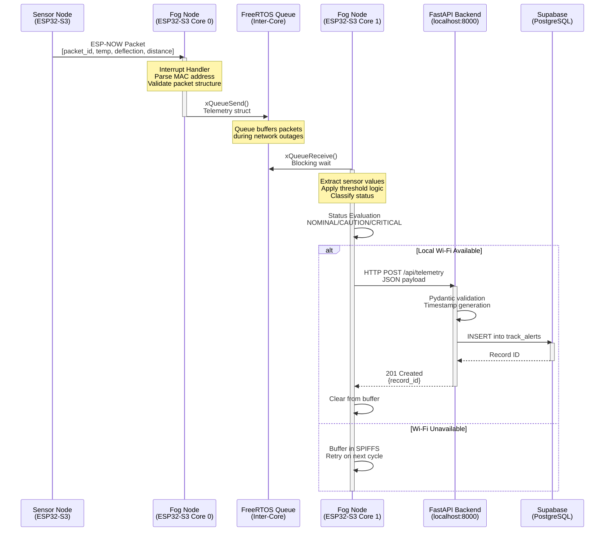

# Track-Watch System Architecture

## Executive System Overview

Track-Watch is a 4-tier edge-to-cloud railway track health monitoring system that combines real-time IoT telemetry with grounded AI-powered maintenance recommendations using Retrieval-Augmented Generation (RAG).

### Tier 1: Edge Layer (Sensor Nodes)
- **Hardware**: ESP32-S3 sensor modules with LM35 temperature sensors, flex sensors for deflection measurement, and HC-SR04 ultrasonic distance sensors
- **Communication**: ESP-NOW protocol for low-latency, loss-tolerant wireless telemetry transmission
- **Function**: Continuous sensor sampling at configurable intervals, edge-triggered alert generation based on configurable thresholds

### Tier 2: Fog Layer (ESP32-S3 Gateway)
- **Hardware**: Dual-core ESP32-S3 acting as aggregation gateway
- **Architecture**: FreeRTOS with inter-core communication via queues
  - **Core 0**: ESP-NOW receiver interrupt handler, packet parsing, queue injection
  - **Core 1**: Queue processing, local status evaluation, HTTP POST transmission
- **Connectivity**: Local Wi-Fi network for upstream communication
- **Function**: Telemetry aggregation, local alert classification (NOMINAL/CAUTION/CRITICAL), buffered transmission to cloud gateway

### Tier 3: Cloud Gateway Layer (FastAPI Backend)
- **Technology**: Python FastAPI running on uvicorn
- **Database**: Supabase PostgreSQL with pgvector extension for similarity search
- **Function**: 
  - Telemetry ingestion endpoint (`POST /api/telemetry`)
  - Alert analysis endpoint (`POST /api/alerts/{id}/analyze`)
  - Health monitoring and CORS-enabled API access

### Tier 4: Local RAG Engine (AI Inference)
- **Embedding Model**: SentenceTransformers (all-MiniLM-L6-v2, 384-dimensional vectors)
- **Vector Database**: Supabase `railway_knowledge_base` table with embedded RDSO track safety manuals
- **LLM**: Ollama running llama3.2:3b locally for grounded maintenance recommendations
- **Function**: Vector similarity search, context-aware prompt engineering, natural language maintenance checklist generation

---

## Telemetry Loop: Sequence Diagram



---

## Vector RAG Evaluation Loop: Flowchart

```mermaid
flowchart TD
    A[Frontend Dashboard] -->|User requests analysis| B[FastAPI Endpoint<br/>POST /api/alerts/{id}/analyze]
    
    B --> C[Step 1: Fetch Alert Metrics]
    C --> D[Supabase Query<br/>track_alerts table]
    D -->|Alert found| E[Step 2: Build Natural Language Query]
    D -->|Alert not found| X[HTTP 404 Error]
    
    E --> F[Step 3: Generate Embedding]
    F --> G[SentenceTransformers<br/>all-MiniLM-L6-v2]
    G --> H[384-dimensional vector]
    
    H --> I[Step 4: Vector Similarity Search]
    I --> J[Supabase RPC<br/>match_railway_knowledge]
    J --> K[Top-3 matched chunks<br/>with similarity scores]
    
    K --> L[Step 5: Context Compilation]
    L --> M[Format context blocks<br/>with document metadata]
    
    M --> N[Step 6: LLM Prompt Engineering]
    N --> O[System Prompt<br/>Track-Watch AI persona]
    N --> P[User Prompt<br/>Telemetry + Context]
    
    O --> Q[Step 7: Ollama Inference]
    P --> Q
    Q --> R[llama3.2:3b<br/>Local LLM]
    R --> S[Grounded Maintenance Checklist]
    
    S --> T[Step 8: Response Packaging]
    T --> U[AnalysisResponse JSON<br/>alert_id, query, matched_documents, llm_analysis]
    U --> V[HTTP 200 Response]
    
    V --> W[Frontend Dashboard<br/>Display maintenance plan]
    
    style A fill:#e1f5ff
    style B fill:#ffe1e1
    style Q fill:#e1ffe1
    style R fill:#e1ffe1
    style W fill:#e1f5ff
    style X fill:#ffcccc
```

---

## Data Contracts

### Fog Node → FastAPI Telemetry Payload

**Endpoint**: `POST http://localhost:8000/api/telemetry`

**Content-Type**: `application/json`

```json
{
  "packet_id": 1024,
  "track_section": "KM-42-DELHI",
  "temperature_c": 32.4,
  "deflection_pct": 12.5,
  "distance_cm": 31.8,
  "status": "CAUTION",
  "timestamp": "2026-05-17T09:30:00.000Z"
}
```

**Field Specifications**:

| Field | Type | Required | Description | Valid Values |
|-------|------|----------|-------------|--------------|
| `packet_id` | integer | Yes | Monotonically increasing counter from fog node | ≥ 0 |
| `track_section` | string | No | Track section identifier | Any string (default: "KM-42-DELHI") |
| `temperature_c` | float | Yes | LM35 temperature reading in Celsius | -40.0 to 125.0 |
| `deflection_pct` | float | Yes | Flex-sensor derived deflection percentage | 0.0 to 100.0 |
| `distance_cm` | float | Yes | HC-SR04 ultrasonic distance in cm | 0.0 to 400.0 |
| `status` | string | No | Edge-evaluated status classification | "NOMINAL", "CAUTION", "CRITICAL" |
| `timestamp` | string | No | ISO-8601 UTC timestamp | Auto-generated if omitted |

**Success Response** (HTTP 201):

```json
{
  "message": "Telemetry ingested successfully.",
  "record_id": 16
}
```

---

### FastAPI → Frontend Analysis Response

**Endpoint**: `POST http://localhost:8000/api/alerts/{id}/analyze`

**Content-Type**: `application/json`

**Request**: No request body (alert_id in URL path)

**Success Response** (HTTP 200):

```json
{
  "alert_id": 16,
  "query": "Railway track alert on section KM-42-DELHI. Status: CAUTION. Temperature: 25.0°C. Deflection: 8.33%. Distance clearance: 2.3 cm. What maintenance actions are recommended for these readings?",
  "matched_documents": 3,
  "llm_analysis": "**Maintenance Analysis and Checklist**\n\n**Severity Assessment:** CAUTION\n\n**Root Cause Hypothesis:**\nBased on sensor readings, the potential root cause hypothesis is that there might be a foreign object or obstruction within the track clearance zone, causing the distance sensor to report a value of 2.3 cm.\n\n**Immediate Actions (Numbered Steps):**\n\n1. **Request Track Block**: Immediately request a track block to prevent unauthorized access and ensure safety.\n2. **Conduct Rack Drainage Inspection**: Perform a rack drainage inspection to check for any foreign objects or debris that might be causing the clearance issue.\n3. **Check Ballast Contamination**: Verify if ballast contamination is within acceptable limits (less than 30% fines).\n4. **Inspect Formation Settlement**: Investigate formation settlement using trial pits to ensure it's within acceptable limits (below 2% deflection).\n\n**Follow-up Inspections Required:**\n\n1. **Monthly Trend Report**: Submit a monthly trend report to the Chief Track Engineer, including sensor values and maintenance actions taken.\n2. **Section Track Register Update**: Log the alert in the Section Track Register, referencing the triggering alert ID and sensor values.\n\n**Relevant RDSO Circular References:**\n\n* Safety Circular 2021/S-07 (sections 2.2, 2.3, and 5.1)\n* Railways Act, 1989, Section 147 (intrusion detection protocol)\n\n**Additional Notes:**\nPlease ensure that all maintenance actions taken are documented in the Section Track Register, referencing the triggering alert ID and sensor values."
}
```

**Field Specifications**:

| Field | Type | Description |
|-------|------|-------------|
| `alert_id` | integer | The alert ID that was analyzed |
| `query` | string | The natural language query constructed from telemetry metrics |
| `matched_documents` | integer | Number of knowledge base chunks matched via vector similarity |
| `llm_analysis` | string | Grounded maintenance checklist generated by llama3.2:3b |

**Error Responses**:

- **404 Not Found**: Alert ID does not exist in `track_alerts` table
- **503 Service Unavailable**: Supabase client or embedding model not initialized
- **504 Gateway Timeout**: Ollama LLM inference exceeded timeout (120s)
- **502 Bad Gateway**: Ollama service error or communication failure

---

## Technology Stack Summary

| Layer | Technology | Purpose |
|-------|-----------|---------|
| **Edge** | ESP32-S3 + ESP-NOW | Low-power sensor nodes with loss-tolerant networking |
| **Fog** | ESP32-S3 + FreeRTOS | Dual-core gateway with inter-core queue communication |
| **Cloud Gateway** | Python + FastAPI + uvicorn | RESTful API with async request handling |
| **Database** | Supabase + PostgreSQL + pgvector | Relational database with vector similarity search |
| **Embeddings** | SentenceTransformers (all-MiniLM-L6-v2) | 384-dim semantic embeddings for RAG |
| **LLM** | Ollama + llama3.2:3b | Local inference for grounded maintenance recommendations |
| **Frontend** | (To be implemented) | React dashboard for real-time monitoring and analysis |

---

## System Constraints & Design Decisions

### Why ESP-NOW for Edge Communication?
- **Ultra-low latency**: Sub-millisecond transmission without Wi-Fi association overhead
- **Loss tolerance**: Designed for unreliable links; fog node handles missing packets
- **Power efficiency**: No need for full Wi-Fi stack on sensor nodes
- **Simplicity**: No broker or routing infrastructure required

### Why Dual-Core ESP32-S3 for Fog Node?
- **Core 0**: Dedicated to time-critical ESP-NOW interrupt handling
- **Core 1**: Handles non-blocking HTTP transmission and local processing
- **Queue-based decoupling**: Prevents packet loss during network outages
- **FreeRTOS**: Real-time guarantees for sensor data processing

### Why Local Ollama vs Cloud LLM?
- **Data privacy**: Sensitive railway telemetry never leaves premises
- **Latency**: No network round-trip for inference
- **Cost**: No per-token API charges
- **Reliability**: No dependency on external service availability
- **Grounding**: Full control over RAG context and prompt engineering

### Why Supabase with pgvector?
- **Managed PostgreSQL**: No database administration overhead
- **Built-in vector search**: pgvector extension for cosine similarity
- **Real-time subscriptions**: Future frontend can subscribe to live alerts
- **Row-level security**: Built-in authentication and authorization
- **Edge functions**: Optional serverless compute for future scalability

---

## Performance Characteristics

| Metric | Target | Notes |
|--------|--------|-------|
| **Sensor sampling rate** | 1-10 Hz | Configurable per sensor node |
| **ESP-NOW latency** | < 5 ms | Line-of-sight, < 100m range |
| **Fog-to-cloud latency** | 100-500 ms | Dependent on local Wi-Fi |
| **Vector search latency** | < 100 ms | 13 chunks, pgvector index |
| **LLM inference latency** | 30-90 s | llama3.2:3b, 1024 tokens |
| **End-to-end analysis** | < 2 min | From alert trigger to maintenance plan |

---

## Security Considerations

- **ESP-NOW**: No encryption by default; consider adding application-layer encryption for production
- **Wi-Fi**: Use WPA3-Enterprise for fog node authentication
- **API**: Implement API key authentication for frontend access
- **Supabase**: Enable Row-Level Security (RLS) policies for multi-tenant deployments
- **Ollama**: Bind to localhost only; no external exposure
- **HTTPS**: Use reverse proxy (nginx/caddy) for production TLS termination

---

## Future Enhancements

1. **Frontend Dashboard**: React-based real-time monitoring with alert history and analysis visualization
2. **Alert Subscription**: Supabase real-time subscriptions for live frontend updates
3. **Historical Trending**: Time-series analysis for predictive maintenance
4. **Multi-section Support**: Scalable architecture for monitoring multiple track sections
5. **Mobile Alerts**: SMS/push notifications for CRITICAL alerts
6. **Model Fine-tuning**: Domain-specific fine-tuning of LLM on railway maintenance corpus
7. **Edge ML**: On-device anomaly detection using TensorFlow Lite Micro
