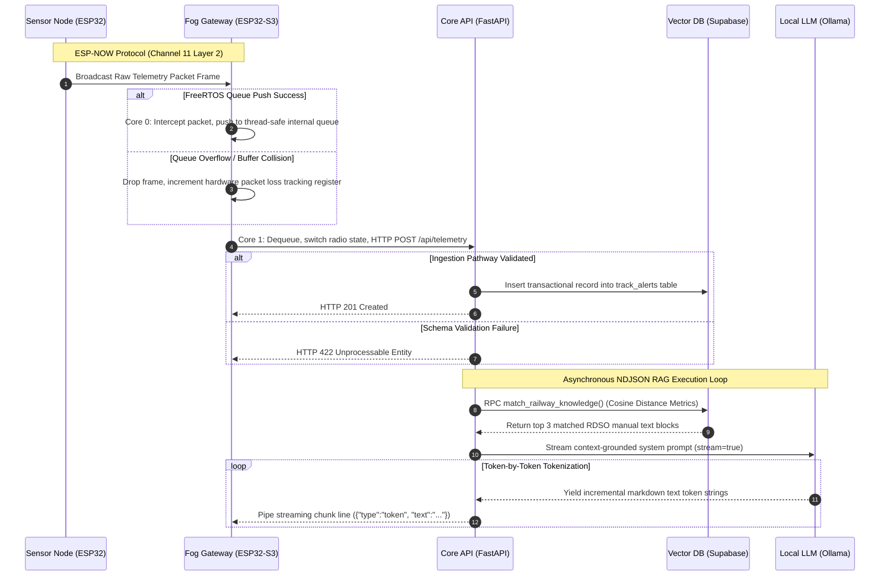

# Track-Watch

An edge-to-cloud railway track structural safety monitoring and automated regulatory compliance validation system.

Telemetry data is sampled from physical instrumentation sensors via a standalone edge node, transmitted using layer-2 ESP-NOW protocols to a dual-core gateway, pushed upstream via HTTP POST to a FastAPI application gateway, and persisted in a Supabase PostgreSQL instance. A localized Retrieval-Augmented Generation (RAG) engine transforms structural anomalies into dense text tensors via all-MiniLM-L6-v2, queries adjacent regulatory safety circulars via pgvector similarity matching, and triggers an asynchronous NDJSON token stream from a local Ollama Llama 3.2 3B daemon to render audit-compliant engineering checklists.

### Dependencies

* Python 3.13
* Ollama (Llama 3.2 3B Engine)
* Supabase PostgreSQL (with pgvector extension)
* Arduino IDE (with ESP32/ESP32-S3 core toolchains)

### Setup

1. Initialize local database schema tables via Supabase SQL Editor using the data model matrices defined in `ARCHITECTURE.md`.

2. Install pinned backend dependencies:
   ```bash
   pip install -r backend/requirements.txt
   ```

3. Configure local environment variables:
   ```bash
   cp backend/.env.example backend/.env
   ```

4. Populate knowledge directories and execute vector store ingestion seeder:
   ```bash
   python backend/ingest_docs.py
   ```

5. Compile and flash firmware binaries to microcontrollers over native serial interfaces:
   ```
   Compile hardware/sensor-node/sensor-node.ino -> Target: ESP32 Dev Module
   Compile hardware/fog-node/fog-node.ino -> Target: ESP32-S3 Dev Module
   ```

6. Initialize local AI inference engine daemon:
   ```bash
   ollama run llama3.2:3b
   ```

7. Launch core FastAPI backend application server:
   ```bash
   python backend/main.py
   ```

8. Launch the dashboard interface by opening `dashboard/index.html` in a standard browser environment.

### Architecture



### Known Limitations

* Prototype edge firmware lacks payload-layer transport encryption over raw ESP-NOW broadcasts.
* Fixed client-side polling interval increases connection overhead under high client concurrency.
* Local vector tensor calculations block execution threads if hardware environment lacks active GPU acceleration.
