# Track-Watch

Edge-to-cloud railway track safety monitoring with RAG-grounded maintenance recommendations.

ESP32-S3 sensor nodes sample temperature (LM35), deflection (flex sensor), and track clearance (HC-SR04) at 1Hz. Packets transmit over ESP-NOW to a dual-core ESP32-S3 fog gateway running FreeRTOS — Core 0 handles ESP-NOW interrupts, Core 1 evaluates thresholds and POSTs anomalies to a FastAPI backend over WiFi. The backend stores telemetry in Supabase (PostgreSQL + pgvector), and on demand, runs a RAG pipeline: embed the alert query with sentence-transformers (all-MiniLM-L6-v2, 384-dim), vector-search RDSO maintenance manuals, and synthesize a grounded maintenance checklist via local Ollama (llama3.2:3b).

## Dependencies

- Python 3.13+
- FastAPI, uvicorn, pydantic, httpx, python-dotenv
- supabase-py, sentence-transformers
- Ollama with `llama3.2:3b` pulled
- Supabase project with pgvector extension enabled
- Arduino ESP32 board package (ESP32-S3)
- ESP-NOW, WiFi, HTTPClient (Arduino libraries)

## Setup

### Hardware

1. Flash `hardware/sensor-node/sensor-node.ino` to each ESP32-S3 sensor node
2. Copy `hardware/fog-node/secrets.h.example` to `secrets.h`, fill credentials
3. Flash `hardware/fog-node/fog-node.ino` to the fog gateway ESP32-S3
4. All devices must be on ESP-NOW channel 11

### Backend

1. `cd backend`
2. `pip install -r requirements.txt`
3. `cp .env.example .env` — fill Supabase credentials
4. `ollama pull llama3.2:3b`
5. `python ingest_docs.py` — seeds RDSO manuals into vector store
6. `uvicorn main:app --host 0.0.0.0 --port 8000 --reload`

### Dashboard

1. `cd dashboard`
2. `python -m http.server 3000`
3. Open `http://localhost:3000`

## Architecture

```mermaid
graph TD
    SN1["Sensor Node 1<br/>ESP32-S3 + LM35 + Flex + HC-SR04"] -->|ESP-NOW| FG
    SN2["Sensor Node 2<br/>ESP32-S3"] -->|ESP-NOW| FG
    SNn["Sensor Node N<br/>ESP32-S3"] -->|ESP-NOW| FG

    FG["Fog Gateway<br/>ESP32-S3 Dual-Core FreeRTOS"] -->|"HTTP POST /api/telemetry<br/>WiFi"| API

    API["FastAPI Backend<br/>Python + uvicorn"] --> DB[("Supabase<br/>PostgreSQL + pgvector")]
    API --> EMB["SentenceTransformers<br/>all-MiniLM-L6-v2"]
    API --> LLM["Ollama<br/>llama3.2:3b"]

    DB -->|"Vector search<br/>match_railway_knowledge"| API
    EMB -->|384-dim embedding| API
    LLM -->|Maintenance checklist| API

    DASH["Dashboard<br/>Tailwind + Vanilla JS"] -->|"GET /api/alerts<br/>POST /api/alerts/id/analyze"| API

    style FG fill:#1e293b,stroke:#f59e0b
    style API fill:#1e293b,stroke:#22c55e
    style LLM fill:#1e293b,stroke:#ef4444
```

## API

| Method | Endpoint | Purpose |
|--------|----------|---------|
| POST | `/api/telemetry` | Ingest telemetry from fog node |
| GET | `/api/alerts?limit=20` | List recent alerts (newest first) |
| POST | `/api/alerts/{id}/analyze` | Run RAG pipeline on a specific alert |
| GET | `/health` | Liveness probe |

## Known Limitations

- ESP-NOW has no encryption. Application-layer encryption needed for production.
- LLM inference takes 30-90s on CPU. No streaming — the dashboard fakes progress steps.
- Single track section (`KM-42-DELHI`) hardcoded in fog node firmware.
- No authentication on the API. Add API key middleware before any real deployment.
- pgvector similarity search is brute-force on 13 chunks. Fine for prototype, not for 10k+ documents.
- The flex sensor calibration baseline (330 flat / 150 bent) is specific to the sensor unit used in development.

## Author

Arindam Shandilya — shandilyarindam@gmail.com
